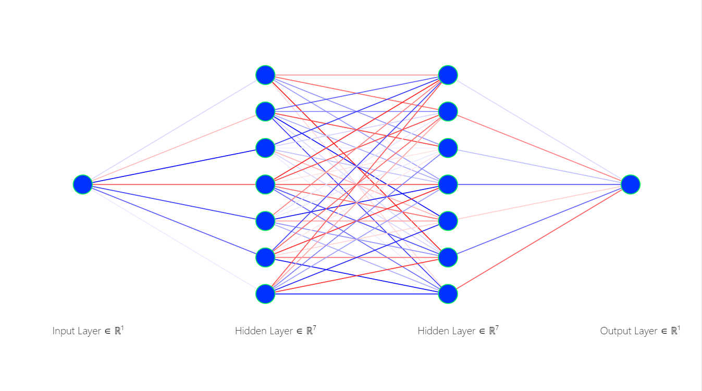
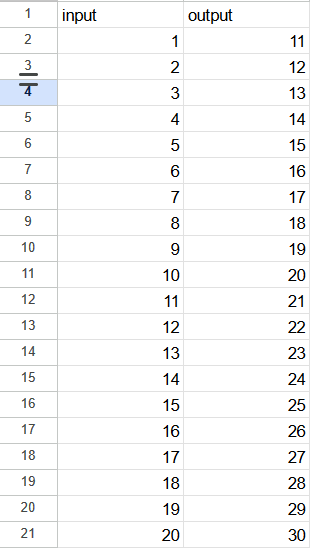
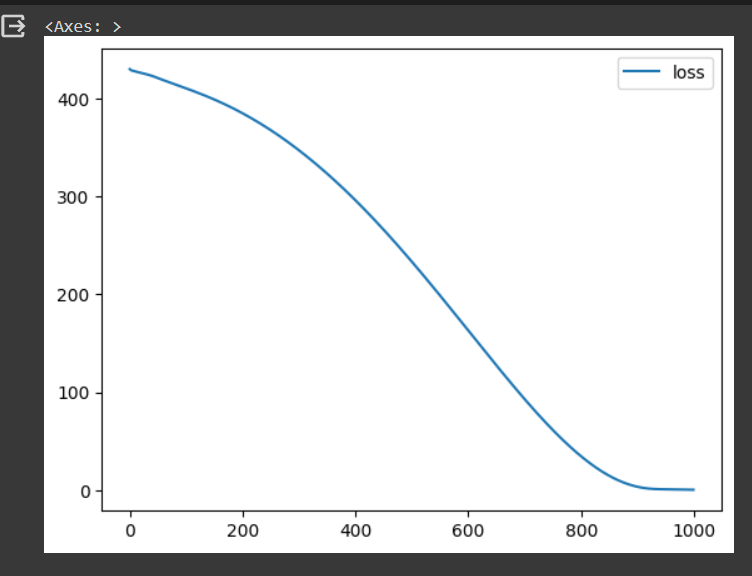
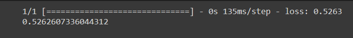
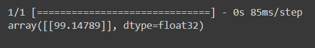

# Developing a Neural Network Regression Model

## AIM

To develop a neural network regression model for the given dataset.

## THEORY
Neural networks consist of simple input/output units called neurons. These units are interconnected and each connection has a weight associated with it. Neural networks are flexible and can be used for both classification and regression. In this article, we will see how neural networks can be applied to regression problems.

In this model we will discuss with a neural network with 3 layers of neurons excluding input . First hidden layer with 7 neurons , Second hidden layer with 7 neurons and final Output layer with 1 neuron to predict the regression case scenario.

## Neural Network Model


## DESIGN STEPS

### STEP 1:

Loading the dataset

### STEP 2:

Split the dataset into training and testing

### STEP 3:

Create MinMaxScalar objects ,fit the model and transform the data.

### STEP 4:

Build the Neural Network Model and compile the model.

### STEP 5:

Train the model with the training data.

### STEP 6:

Plot the performance plot

### STEP 7:

Evaluate the model with the testing data.

## PROGRAM
### Name: VINOD KUMAR S
### Register Number: 212222240116
```python

Include your code here
from google.colab import auth
import gspread
from google.auth import default
import pandas as pd

auth.authenticate_user()
creds, _ = default()
gc = gspread.authorize(creds)

worksheet = gc.open('ML').sheet1

rows = worksheet.get_all_values()

df = pd.DataFrame(rows[1:], columns=rows[0])
df = df.astype({'input':'float'})
df = df.astype({'output':'float'})
df.head()

from sklearn.model_selection import train_test_split

from sklearn.preprocessing import MinMaxScaler

from tensorflow.keras.models import Sequential
from tensorflow.keras.layers import Dense

X = df[['input']].values
y = df[['output']].values

X

X_train,X_test,y_train,y_test = train_test_split(X,y,test_size = 0.33,random_state = 33)

Scaler = MinMaxScaler()
Scaler.fit(X_train)
X_train1 = Scaler.transform(X_train)
ai_brain = Sequential([
    Dense(7,activation='relu'),
    Dense(7,activation='relu'),
    Dense(1)
])

ai_brain.compile(optimizer = 'rmsprop' , loss = 'mse')

ai_brain.fit(X_train1 , y_train,epochs = 1000)
loss_df = pd.DataFrame(ai_brain.history.history)
loss_df.plot()

X_test1 = Scaler.transform(X_test)
ai_brain.evaluate(X_test1,y_test)

X_n1 = [[100]]
X_n1_1 = Scaler.transform(X_n1)

ai_brain.predict(X_n1_1)

```
## Dataset Information



## OUTPUT

### Training Loss Vs Iteration Plot


### Test Data Root Mean Squared Error



### New Sample Data Prediction


## RESULT

Thus a neural network regression model for the given dataset is written and executed successfully.


